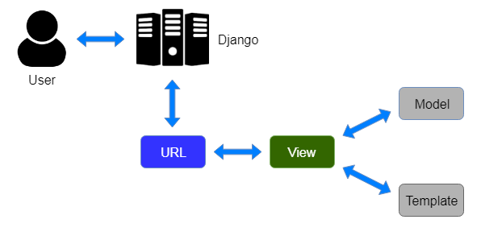

<!--To install virtual env-->

pip install virtualenv

<!--To create virtual env-->

python -m venv env

or

python -m venv myenv

<!--To get into virtual env-->

`for linux`:
source env/bin/activate

<!--to create django-project-->

django-admin startproject <PROJECT NAME> .

<!--to create django app-->

python manage.py startapp <APP NAME>

<!--to run the django program -->

python manage.py runserver
